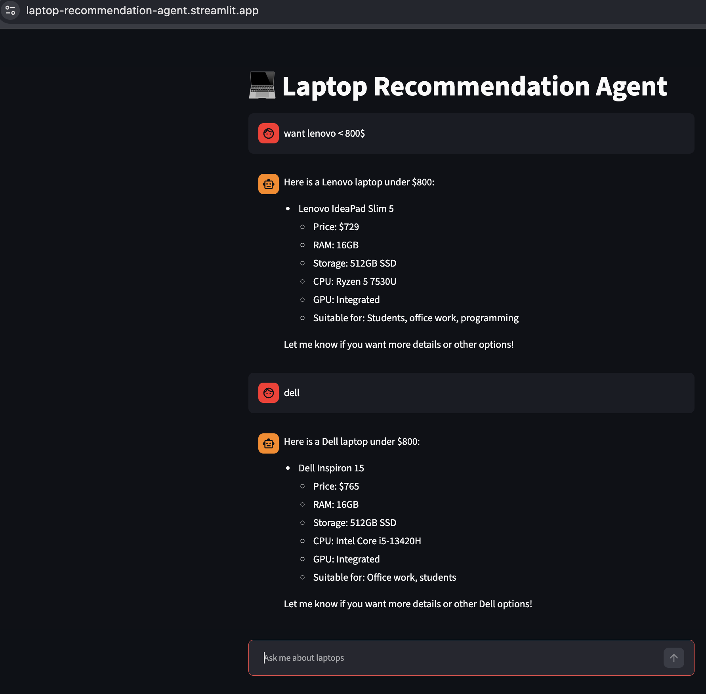

# Laptop Recommendation Agent

An AI-powered laptop recommendation app that uses a conversational agent and a local laptop catalog to help users find options by brand, budget, and RAM.

The project separates the user interface from the agent API: Streamlit provides the chat experience, while FastAPI exposes the /chat endpoint that invokes a LangGraph ReAct agent.

Live Demo: [laptop-recommendation-agent.streamlit.app](https://laptop-recommendation-agent.streamlit.app/)

## UI Preview



## Highlights

Conversational laptop recommendations based on user preferences.

LangGraph ReAct agent with tools for brand, budget, and RAM searches.

SQLite-backed local laptop catalog.

Streamlit chat UI with conversation history.

FastAPI backend for a clean UI-to-agent boundary.

Docker, Kubernetes, Helm, and GitHub Actions configuration for hands-on deployment and CI experimentation.

## Tech Stack

Python, FastAPI, Streamlit

LangChain, LangGraph, OpenAI

SQLite

Docker, Kubernetes, Helm, GitHub Actions

## Architecture

• Browser User Input
  • Streamlit UI (app.py)
    • FastAPI /chat endpoint (api.py)
      • LangGraph ReAct Agent (agent.py)
        • Search tools (tools.py) & SQLite catalog (db.py)
          • OpenAI API
            • Response back to UI

## Project Structure

• **app.py** — Streamlit chat UI
• **api.py** — FastAPI /chat endpoint
• **agent.py** — LangGraph agent and preference handling
• **tools.py** — Laptop search tools
• **db.py** — SQLite access
• **laptops.db** — Local laptop catalog
• **llm.py** — OpenAI model configuration
• **requirements.txt** — Python dependencies
• **Dockerfile** — Container configuration
• **k8s/** — Kubernetes manifests (deployment, service)
• **helm/** — Helm chart for orchestration

## Run Locally

### Prerequisites

Python 3.12+

An OpenAI API key

Create a .env file in the project root:

OPENAI_API_KEY=your_api_key

Install dependencies and start the API in one terminal:

python3 -m venv .venv
source .venv/bin/activate
python -m pip install -r requirements.txt
uvicorn api:app --reload

In a second terminal, start the Streamlit UI:

source .venv/bin/activate
streamlit run app.py

The Streamlit UI uses `http://127.0.0.1:8000` when the API is running locally. For the deployed backend, set:

```env
API_URL=https://laptop-recommendation-agent.onrender.com

### Quality Checks

black --check .
ruff check .
python -m compileall .

## Container and Kubernetes Notes

The Dockerfile packages the Streamlit UI. When running it locally, set API_URL to a FastAPI service reachable from the container.

docker build -t laptop-recommendation-agent .
docker run --rm -p 8501:8501 \
  -e API_URL=http://host.docker.internal:8000 \
  laptop-recommendation-agent

Kubernetes manifests are available in k8s/, and a Helm chart is available in helm/. The Helm deployment expects an existing laptop-agent-secrets secret containing OPENAI_API_KEY.

helm lint ./helm
helm install laptop-agent ./helm

Current Scope

This is a personal learning project. Recommendations are based on the local SQLite catalog and agent tools; it is not a production e-commerce service.